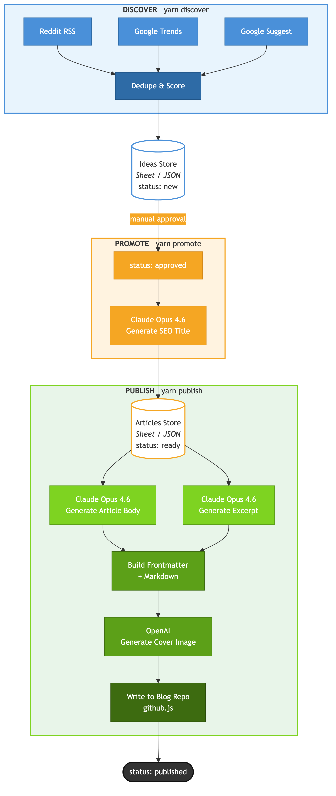

# SEO Engine

Zero-API SEO content engine for the Host My Nest blog. Discovers keywords, generates articles with Claude Opus 4.6, and publishes to a blog repo.

## Flow Diagram



## Pipeline

Three stages, each a standalone Node script:

1. **Discover** (`yarn discover`) — pulls keyword ideas from Reddit RSS, Google Trends, Google Suggest, Google News RSS, and Bing Suggest. A shared `isRelevant()` filter drops off-topic noise before scoring/deduping. Posts a digest to Slack with a link to review in Google Sheets.
2. **Promote** (`yarn promote`) — takes ideas with `status: approved`, generates an SEO title via Claude, and adds them to the Articles sheet/queue as `ready`.
3. **Publish** (`yarn pub`) — picks the next `ready` article, generates body + excerpt + category + CTA banners (Claude) + cover image (Gemini), writes markdown with frontmatter, opens a PR on the blog repo, and posts the PR link to Slack.

> Script is `yarn pub` (not `publish`) to avoid collision with yarn's built-in `publish` command.

## Tech Stack

- Node >= 20, ES modules (`"type": "module"`)
- Claude Opus 4.6 via raw `fetch` to the Anthropic Messages API (`scripts/lib/claude.js`)
- Gemini 3 Pro Image (Nano Banana 2) for cover images (`scripts/lib/images.js`)
- Google Sheets as primary data store, JSON files as fallback (`scripts/lib/store.js`)
- No frameworks — plain scripts with shared libs under `scripts/lib/`

## Project Structure

```
config/
  seeds.json       # subreddits, seed keywords, geo, default category, author
  prompts.js       # all Claude prompt text (system + user templates)
  schema.js        # column definitions for Ideas and Articles tables
scripts/
  discover.js      # stage 1
  promote.js       # stage 2
  publish.js       # stage 3
  lib/
    claude.js      # Claude API wrapper (article, excerpt, title, category, CTAs)
    images.js      # Gemini 3 Pro Image cover generation
    github.js      # blog repo PR creation via GitHub API (or local disk fallback)
    slack.js       # Incoming Webhook notifier (no-ops if SLACK_WEBHOOK_URL unset)
    store.js       # storage adapter (Google Sheets or JSON fallback)
    sheet.js       # Google Sheets backend (incl. tabUrl for Slack deep-links)
    queue.js       # JSON file backend
    util.js        # slugify, today, scoreIdea, dedupeByKeyword, isRelevant, buildFrontmatter
    sources/
      reddit.js    # Reddit RSS scraper
      trends.js    # Google Trends RSS
      suggest.js   # Google Suggest autocomplete
      news.js      # Google News RSS (per seed, UK-scoped)
      bing.js      # Bing Suggest (UK-scoped via mkt=en-GB)
data/
  content-ideas.json   # JSON fallback for Ideas
  content-queue.json   # JSON fallback for Articles
tests/
  util.test.js    # node --test
```

## Environment Variables

- `ANTHROPIC_API_KEY` — required for promote and publish stages
- `GEMINI_API_KEY` — required for publish stage (cover images via Gemini 3 Pro Image)
- `GOOGLE_SERVICE_ACCOUNT_JSON` + `GOOGLE_SHEET_ID` — optional, enables Google Sheets backend
- `SLACK_WEBHOOK_URL` — optional, enables Slack notifications (publish success/failure + discover digest)
- `BLOG_REPO_OWNER` + `BLOG_REPO_NAME` + `BLOG_REPO_TOKEN` (+ optional `BLOG_REPO_BRANCH`) — enables GitHub API mode; publish opens a PR on the blog repo instead of writing to local disk

## Data Model

**Ideas** statuses: `new` → `approved` → `queued` (or `rejected`)
**Articles** statuses: `ready` → `generating` → `published` (or `error`)

## Conventions

- British English in all generated content
- Prompts live in `config/prompts.js` — tune copy there, not in scripts
- Internal links weave naturally through body H2/H3 sections and `## The Bottom Line` (intro stays link-free for punch)
- Every article includes a `## Frequently Asked Questions` section with 4–6 H3 questions before The Bottom Line
- Relevance filter (`isRelevant` in `util.js`) gates all discovery sources via topic/block token lists — tune there to change what's in/out
- All scoring: `final_score = trend_score * 0.6 + min(reddit_score, 500) * 0.4`
- Tests: `yarn test` (Node built-in test runner)

## Deployment

Three GitHub Actions workflows in `.github/workflows/`: `discover.yml` (weekly), `promote.yml` (hourly), `publish.yml` (3x/month). All use `yarn install --frozen-lockfile` then `yarn run <script>`.

## Custom Skills

Slash commands available in Claude Code:

- `/pipeline [discover|promote|pub|all]` — run one or all pipeline stages
- `/discover` — run keyword discovery
- `/promote` — promote approved ideas
- `/publish` — publish next ready article (runs `scripts/publish.js`)
